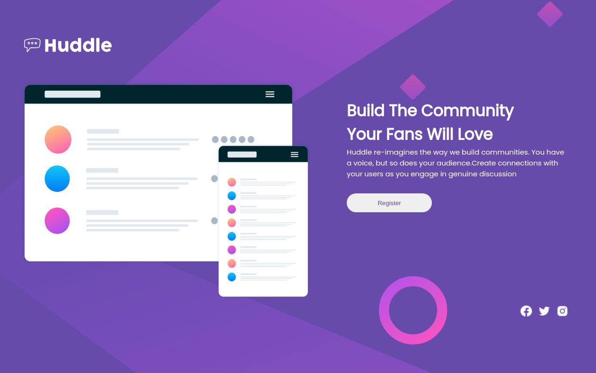

# huddle Landing Page With Single Introductory Section Master

## Sobre o projeto

Esta é uma solução do frontend Mentor com o objetivo de construir uma Página inicial com uma única seção introdutória , e torná-lo o mais semelhante possível ao projeto original. Nele, o usuário deve ser capaz de visualizar o cartão em qualquer dispositivo.

## Layout Desktop

## layout Mobile

# Estilização utilizada

## Cores

### Primária

- Violet: hsl(257, 40%, 49%)
- Soft Magenta: hsl(300, 69%, 71%)

## tipografia

### Headings

- Family: Poppins
- Weights: 400, 600

### Body

- Family: Open Sans
- Weights: 400

## Icons

- Boxicons 
  https://boxicons.com/

# Tecnologias utilizadas

## Front end

- HTML / CSS 

### Modelos de layout utilizados:

- GridLayout
- FlexBox

## Implantação em produção

- Front end web: Netlify
  
# Challenge

- Frontend Mentor
  
# Meu aprendizado neste projeto
  
  Neste projeto esclareci algumas duvidas em relação ao posicionamento das tags para estilização no css. 
  
# Autor

Wesley higino Pereira

https://www.linkedin.com/in/wesleyhigino/
